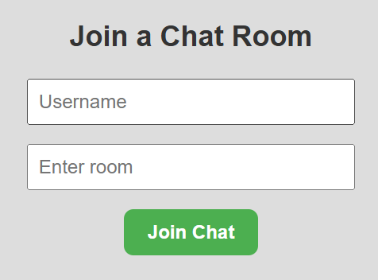
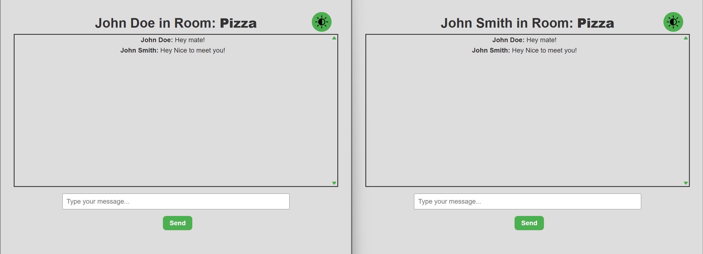

# Chat App

## Overview

Chat App is a real-time chat application built with a modern tech stack. It includes a client-side application developed using React and Vite, and a server-side application built with Node.js and Express. The app allows users to set a username and participate in chat conversations.

## Features

- Real-time chat functionality
- User-friendly interface
- Ability to set a custom username
- Responsive design




### Client

The `client` folder contains the front-end code for the application. It is built using React and Vite for a fast and efficient development experience.

### Server

The `server` folder contains the back-end code for the application. It is built using Node.js and Express to handle API requests and manage real-time communication.

## Local Installation

### Prerequisites

- Node.js (v16 or later)
- npm or yarn

### Steps

1. Clone the repository:

   ```bash
   git clone <repository-url>
   cd Chat App
   ```

2. Install dependencies for both client and server:

   ```bash
   cd client
   npm install
   cd ../server
   npm install
   ```

3. Start the development servers:

   - Client:
     ```bash
     cd client
     npm run dev
     ```
   - Server:
     ```bash
     cd server
     npm start
     ```

4. Open the client application in your browser at `http://localhost:5173`.

## Usage

1. Open the application in your browser.
2. Set your username on the username page.
3. Start chatting in real-time with other users.

## Database

This project uses MongoDB as the database to store chat messages and user information. Ensure you have MongoDB installed and running locally or use a cloud-based MongoDB service like MongoDB Atlas.

### Setting up MongoDB

1. Install MongoDB locally or create a cluster on MongoDB Atlas.
2. Update the connection string in the server configuration file (e.g., `server/app.js`) to point to your MongoDB instance.
3. Ensure the database and collections are properly set up before running the application.
